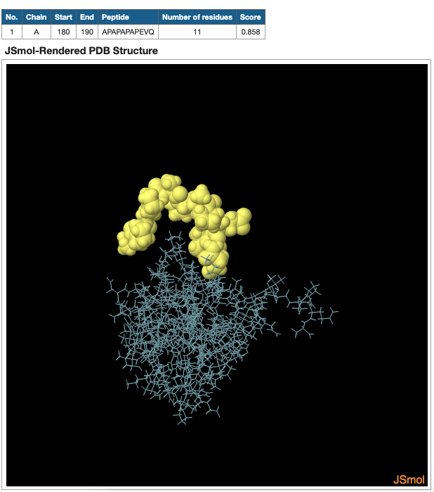

# ellipro-reverse-engineered

The [ElliPro web portal](http://tools.iedb.org/ellipro/) is a tool used to predict antibody epitopes on proteins. To use it, you need to give it information on a protein you want to analyse. This information can be either a [PDB file](https://en.wikipedia.org/wiki/Protein_Data_Bank_(file_format)) of the protein or the protein's PDB ID as given in the [Protein Data Bank repository](https://www.rcsb.org/).

Unfortunately, this web portal accepts only proteins whose PDB information is within 5 megabytes large. Most proteins are small enough to fit within this limit, but there are some big-ass mfs like [protein 2MQE](https://www.rcsb.org/3d-view/2MQE), which the web portal refuses to accept for analysis. So this project tries to get around this problem.

## Setup

### Set up the PDB files

From this project's root directory, create the folder `media/tmp/ellipro`:

```
mkdir -p ./media/tmp/ellipro
```

Put the PDB files of the proteins you want to analyse in that folder. For example, if we have `2mqe.pdb`, we can put it in the folder so that we have `media/tmp/ellipro/2mqe.pdb`. Do this for all the PDB files you need.

### Set up the ElliPro software

Besides being available as a web service, ElliPro is published as a standalone tool as well. We will use this to process the protein's PDB. This tool is a command-line program that's released as a java jar file. Download the latest jar from [here](http://tools.iedb.org/ellipro/download/) or older versions from [here](https://downloads.iedb.org/tools/ellipro/).

## Usage

### 1. Analyse the protein to get its epitopes

Run ElliPro's jar in your terminal. The jar's usage instructions can be found by running:

```
java -jar ElliPro.jar --help
```

From the output of the command above, we see that we can use the `-f` argument to tell ElliPro which PDB file to analyse:

```
java -jar ElliPro.jar -f <my-pdb-file>.pdb
```

The output of the ElliPro program will be put into a new file (`output.txt` by default). Print the contents of that file by running:

```
cat output.txt
```

Here's an example of the contents of `output.txt`:

```
No.,Structure,Chain,Start Position,End Position,Peptide,Number of Residues,Score,Type
1,F17A,A,107,117,SGWCVGANTAS,11,0.762,Linear
2,F17A,A,153,163,YNGSSAGSVQT,11,0.758,Linear
3,F17A,A,129,142,ILKRNRYSVQK,11,0.712,Linear
4,F17A,A,62,71,LPVVGSLDGQ,10,0.702,Linear
5,F17A,A,13,38,GPSLGSYSLPFVYTRNKI,18,0.663,Linear
6,F17A,A,47,53,HISKGFC,7,0.659,Linear
7,F17A,A,170,176,NPFTLND,7,0.658,Linear
8,F17A,A,76,79,LTEE,4,0.576,Linear
9,F17A,A,1,9,AVSFIGSTE,9,0.565,Linear

No.,Structure,Residues,Number of Residues,Score,Type
1,F17A,A:A1, A:V2, A:S3, A:F4, A:I5, A:G6, A:S7, A:T8, A:E9, A:H47, A:S49, A:K50, A:G51, A:F52, A:C53, A:C110, A:V111, A:G112, A:A113, A:N114, A:T115, A:A116, A:S117, A:Y153, A:N154, A:G155, A:S156, A:S157, A:A158, A:G159, A:S160, A:V161, A:Q162, A:T163,34,0.718,Discontinous
2,F17A,A:G13, A:P14, A:S15, A:L16, A:G17, A:S18, A:Y19, A:S20, A:L28, A:P29, A:F30, A:V31, A:Y32, A:T34, A:L76, A:T77, A:E78, A:E79, A:I129, A:L130, A:K131, A:R132, A:N133, A:R137, A:Y138, A:S139, A:Q141, A:N170, A:P171, A:T173, A:L174, A:N175,32,0.7,Discontinous
3,F17A,A:D61, A:L62, A:P63, A:V64, A:V65, A:G66, A:S67, A:L68, A:D69, A:G70, A:Q71, A:S72, A:I73, A:Y74, A:G75, A:M97, A:S98, A:G99, A:N100, A:S101, A:W102,21,0.555,Discontinous
```

These are the epitopes of the protein.

### 2. Render the 3D structure of the protein with the epitopes

The ElliPro web portal renders the 3D structures using a renderer called [JSmol](http://jmol.sourceforge.net/). It comes bundled with the Java version of the renderer called Jmol. JSmol is already included in this project.

You have to:

1. Put the ElliPro's output into the `session` variable found within `epitope.popup.out.html`. Remove any data columns that aren't relevant to the renderer. Look at the existing `session` variable to know which columns are required.
2. Change the last item in the `session` variable array (i.e. `session[3]`) to be the PDB file name of your protein. Look at the existing `session` as an example.
3. Spin up an HTTP static file server so that you can view the `epitope.popup.out.html` in your browser. You can use python for this, as follows:
    ```
    python3 -m http.server 5000
    ```
4. Visit `http://localhost:5000/epitope.popup.out.html?epitope=0&no=0` in your browser

The query string `epitope=0&no=0` in the URL refers to the particular epitope you want to render.

- `epitope=0` refers to the predicted *linear* epitopes
- `epitope=1` refers to the predicted *discontinuous* epitopes
- `no=i` refers to the i'th epitope of either group (linear or discontinuous). This is 0-indexed i.e. 0 refers to the first epitope, 1 refers to the second, and so on.

For example, `epitope=0&no=1` will render the second linear epitope whereas `epitope=1&no=1` will render the second discontinuous epitope. Look at the `session` variable in the `epitope.popup.out.html` file to know how many epitopes of each group are available for the given protein.

You can now view the rendered proteins and their epitopes! The stick-like thing is the protein and the yellow part's the epitope.


